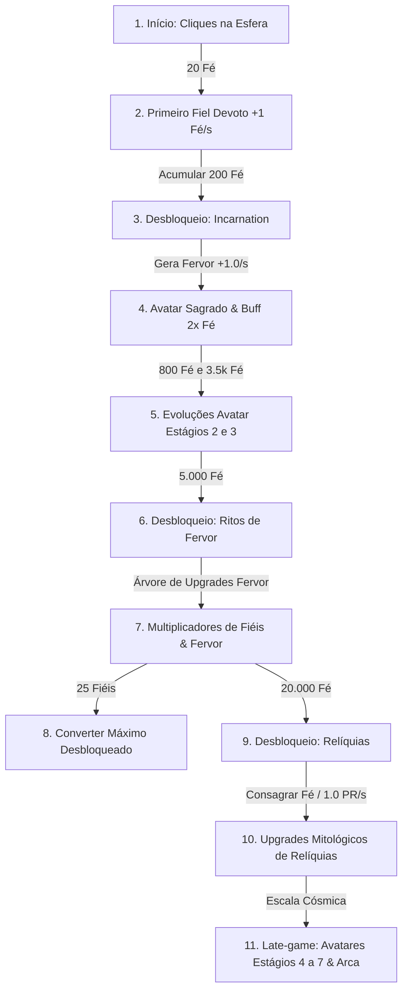

# Análise de Balanceamento & Fluxo de Progressão — Cult of the Sphere

Este documento apresenta uma análise aprofundada de todos os sistemas de progressão atualmente implementados no jogo, mapeando a jornada do jogador desde o primeiro clique até os estágios avançados de Relíquias, acompanhado de estimativas de tempo, identificação de gargalos e sugestões práticas de ajuste.

---

## 1. Fluxo Geral da Jornada do Jogador

A progressão do jogo segue uma estrutura linear de marcos (*unlocks*) associada a camadas de prestígio e recursos secundários:

---

## 2. Linha do Tempo & Estimativas de Progressão

Considerando um jogador ativo com ritmo médio de clique (3 a 5 cliques por segundo no início) e aproveitando os milagres e o buff da Encarnação:

| Fase / Marco | Condição Principal | Fé/s Estimado | Fervor/s | Relíquias/s | Tempo da Fase | Tempo Acumulado |
|---|---|---|---|---|---|---|
| **Fase 1: Primeiros Passos** | 0 → 20 Fé | 0 | 0 | 0 | **~5 a 8 seg** | ~8 seg |
| **Fase 2: Expansão Inicial** | 1 → 5 Fiéis (20 → 120 Fé) | 1 → 5 Fé/s | 0 | 0 | **~30 a 45 seg** | ~50 seg |
| **Fase 3: Incarnation** | Desbloqueio (200 Fé) | 5 → 10 Fé/s | Inicia 1.0/s | 0 | **~10 a 20 seg** | **~1 min 10 s** |
| **Fase 4: Consolidação do Avatar** | 800 Fé (Est. 2) e 15-20 Fiéis | 15 → 40 Fé/s (com buff 2x) | 2.0/s | 0 | **~1.5 a 2.5 min** | **~3.5 min** |
| **Fase 5: Ritos de Fervor** | Desbloqueio (5.000 Fé) | 35 → 65 Fé/s | 2.0 → 4.0/s | 0 | **~1.5 min** | **~5 min** |
| **Fase 6: Multiplicadores de Fervor** | Upgrades Fervor + Estágio 3 (3.5k) | 70 → 220 Fé/s | 4.0 → 15.0/s | 0 | **~1.5 a 2 min** | **~7 min** |
| **Fase 7: Desbloqueio de Relíquias** | 20.000 Fé | 150 → 300 Fé/s | 10.0 → 25.0/s | Inicia 1.0/s | **~1.5 min** | **~8.5 min** |
| **Fase 8: Primeiras Relíquias** | Cornucópia (200 PR) / Tocha (500 PR) | 300 → 1.500 Fé/s | 25.0 → 80.0/s | 1.0/s + Consagração | **~3 a 8 min** | **~12 a 16 min** |
| **Fase 9: Meio/Fim do Ciclo** | Avatar 4 (20k Fé), Draupnir (2k PR) | 2.000 → 15.000 Fé/s | 80 → 400/s | 1.0 → 3.0/s | **~10 a 20 min** | **~25 a 35 min** |
| **Fase 10: Deep Late Game** | Avatar 5-6 (150k / 2M Fé), Arca (15k PR) | 20k → 500k+ Fé/s | 500 → 10.000/s | 3.0 → 10.0/s | **~30 a 60 min+** | **1h a 2h+** |

---

## 3. Análise Detalhada dos Sistemas

### 3.1. Início e Primeiros Fiéis (0 a 1 min)
- **Como está**: O jogador inicia com 0 Fé e 1 Fé por clique. Com 20 cliques (~5 segundos), compra o primeiro Fiel Devoto (+1 Fé/s).
- **Curva de Custo**: A fórmula é `20 × 1.10^N`. Até 10 fiéis, o custo total é de cerca de 320 Fé.
- **Veredito**: Excelente ritmo inicial (*early hook*). O jogador não fica travado e ganha recompensa imediata com menos de 10 segundos de jogo.

### 3.2. Incarnation (1 min a 3 min)
- **Como está**: O marco custa 200 Fé. Ao ser comprado, abre a aba Incarnation e introduz o segundo recurso: **Fervor** (+1.0/s).
- **Mecânica de Clique (Bênção da Encarnação)**: Clicar na Encarnação acumula tempo de **2x Fé/s** (até 60s).
- **Evolução de Estágios**:
  - Estágio 2 (800 Fé) dobra a geração de Fervor (2x).
  - Estágio 3 (3.500 Fé) quadruplica a geração de Fervor (4x).
- **Veredito**: Muito fluido. O bônus de 2x incentiva a alternância de cliques entre a Esfera e o Avatar, acelerando o percurso até os 5.000 Fé de Fervor.

### 3.3. Ritos de Fervor (3 min a 7 min)
- **Como está**: Desbloqueado por 5.000 Fé. Revela 5 melhorias:
  1. `fu_prod` (Custo base 25 Fervor, ×1.5/nv): `1.25^Nível` na produção de Fervor.
  2. `fu_effect` (Custo base 50 Fervor, ×1.6/nv): +50%/nv no bônus passivo de Fervor sobre a Fé.
  3. `fu_click` (Custo base 100 Fervor, ×1.7/nv): +50%/nv no clique manual.
  4. `fu_followers` (Custo base 250 Fervor, ×1.75/nv): +75%/nv na produção dos Fiéis.
  5. `fu_synergy` (Custo base 500 Fervor, ×1.8/nv): converte Fé acumulada em Fervor extra.
- **Veredito**: O upgrade `fu_followers` (+75%/nv) é a espinha dorsal desta fase. Ele rapidamente multiplica a Fé/s de 25-30 para 100-200+, tornando a meta de 20.000 Fé facilmente alcançável em menos de 2 minutos.

### 3.4. Relíquias e Consagração (7 min em diante)
- **Como está**: Desbloqueia com 20.000 Fé.
  - A consagração utiliza a fórmula: `Math.floor(log2(Fé + 1) * 1.75)`.
  - Aos 20.000 Fé, uma consagração rende **25 Relíquias**.
  - O ganho passivo base é de **1.0 Relíquia / seg**.
  - Custos das Relíquias:
    - *Cornucópia*: 200 Relíquias (+20% Fé/s por nível, máx 20).
    - *Tocha*: 500 Relíquias (+20% Fervor/s por nível, máx 20).
    - *Pena de Fênix*: 750 Relíquias (Rito místico).
    - *Báculo de Hermes*: 1.500 Relíquias (Desacelera escala de custo dos Fiéis).
    - *Draupnir*: 2.000 Relíquias (Gera relíquias sem reiniciar Fé).
    - *Arca da Aliança*: 15.000 Relíquias (Multiplicador exponencial de Fé por Relíquias).

---

## 4. Atualizações Recentes de Arquitetura

### ✅ 1. Remoção Completa dos Monumentos
- Os arquivos e referências a monumentos (`src/config/monuments.ts`, tipos em `types.ts`, `saveSystem.ts` e cálculos em `calculations.ts`) foram removidos do código-fonte.
- O foco da geração de Fé passiva agora repousa sobre a congregação de **Fiéis Devotos**, fortemente impulsionada pela sinergia com o **Fervor** e a **Encarnação**.

### ✅ 2. Novo Papel da Incarnation: Fervor Multiplica os Fiéis
- A evolução da Encarnação (Estágios 1 a 7) **não aumenta mais a taxa de geração de Fervor**.
- Em vez disso, a Encarnação canaliza todo o Fervor acumulado para **multiplicar diretamente a produção de Fé dos Fiéis**.
- Isso cria uma ligação dinâmica e satisfatória: Fervor deixa de ser um número isolado e se torna o combustível que faz os seguidores gerarem rios de Fé.

---

## 5. Análise e Sugestões para a Fórmula da Incarnation

O usuário propôs a seguinte estrutura conceitual:
> *"150 de fervor base \* 0.6 ^ 0.05 \* nivel do dragao"*

Analisando a intenção matemática:
- **Base 150 Fervor**: O ponto de referência onde o Fervor começa a ter impacto significativo (atingível nos primeiros minutos pós-desbloqueio).
- **Fator 0.6 / Potência 0.05**: Amortecimento para evitar que números gigantescos quebrem o jogo imediatamente.
- **Nível do Dragão (Estágio da Encarnação)**: Fator de escala onde cada evolução do Avatar multiplica o poder dessa canalização.

Abaixo estão 4 opções de implementação para calibrar essa fórmula:

### Opção A (Implementada no Código — Equilibrada e Intuitiva)
$$\text{Multiplicador} = 1 + \left(\frac{\text{Fervor}}{150}\right)^{0.6} \times \left(1 + 0.5 \times (\text{Estágio} - 1)\right)$$

- **Com 0 Fervor**: Multiplicador = **1.00x** (nunca reduz a produção).
- **Estágio 1 (Avatar Neófito)**:
  - 150 Fervor: $1 + (1)^{0.6} \times 1 = \mathbf{2.00x}$ (dobra a Fé dos fiéis!).
  - 500 Fervor: $1 + (3.33)^{0.6} \approx \mathbf{3.06x}$.
  - 1.500 Fervor: $1 + (10)^{0.6} \approx \mathbf{4.98x}$.
- **Estágio 2 (Avatar Consagrado, fator 1.5x)**:
  - 150 Fervor: $1 + 1 \times 1.5 = \mathbf{2.50x}$.
  - 1.500 Fervor: $1 + 3.98 \times 1.5 \approx \mathbf{6.97x}$.
- **Estágio 3 (Avatar Iluminado, fator 2.0x)**:
  - 1.500 Fervor: $1 + 3.98 \times 2.0 \approx \mathbf{8.96x}$.
  - 5.000 Fervor: $1 + 8.25 \times 2.0 \approx \mathbf{17.50x}$.

*Vantagens*: Muito estável, proporciona saltos nítidos a cada evolução e acompanha perfeitamente os custos em Fé dos estágios seguintes.

---

### Opção B (Adaptação Direta dos Parâmetros Propostos)
$$\text{Multiplicador} = 1 + \left(\frac{\text{Fervor}}{150}\right)^{0.6} \times \text{Estágio}^{0.5}$$

- **Estágio 1, 150 Fervor**: **2.00x**
- **Estágio 2, 600 Fervor**: $1 + 4^{0.6} \times \sqrt{2} \approx \mathbf{4.25x}$
- **Estágio 3, 2.000 Fervor**: $1 + (13.3)^{0.6} \times \sqrt{3} \approx \mathbf{9.21x}$
- **Estágio 4, 10.000 Fervor**: $1 + (66.6)^{0.6} \times 2 \approx \mathbf{25.96x}$

*Vantagens*: Utiliza a raiz quadrada do nível do dragão ($\text{Estágio}^{0.5}$), garantindo que mesmo nos estágios finais o multiplicador continue controlado.

---

### Opção C (Estilo DodecaDragons Puro — Escala Logarítmica)
$$\text{Multiplicador} = 1 + \log_{10}\left(1 + \frac{\text{Fervor}}{150}\right) \times 1.5 \times \text{Estágio}$$

- **Estágio 1, 150 Fervor**: $1 + \log_{10}(2) \times 1.5 \times 1 \approx \mathbf{1.45x}$
- **Estágio 2, 1.500 Fervor**: $1 + \log_{10}(11) \times 1.5 \times 2 \approx \mathbf{4.12x}$
- **Estágio 3, 15.000 Fervor**: $1 + \log_{10}(101) \times 1.5 \times 3 \approx \mathbf{10.02x}$

*Vantagens*: Curva muito suave, ideal para jogos com números hiper-exponenciais onde se deseja desacelerar o ganho passivo.

---

## 6. Próximas Recomendações de Balanceamento

1. **Rebalanceamento da Consagração de Relíquias**:
   - Ajustar a fórmula de consagração de Relíquias para conceder entre 50 e 100 Relíquias no primeiro reset de 20.000 Fé, ou baratear a Cornucópia para 25-50 Relíquias.
2. **Ativação dos Buffs das Conquistas**:
   - Ligar os multiplicadores das Conquistas em `calculations.ts` para que cada marco conquistado dê de +5% a +15% de multiplicador real.

