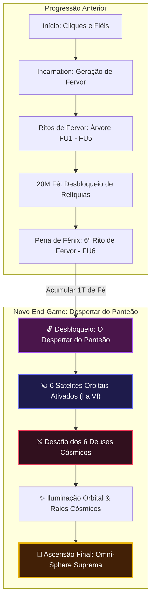
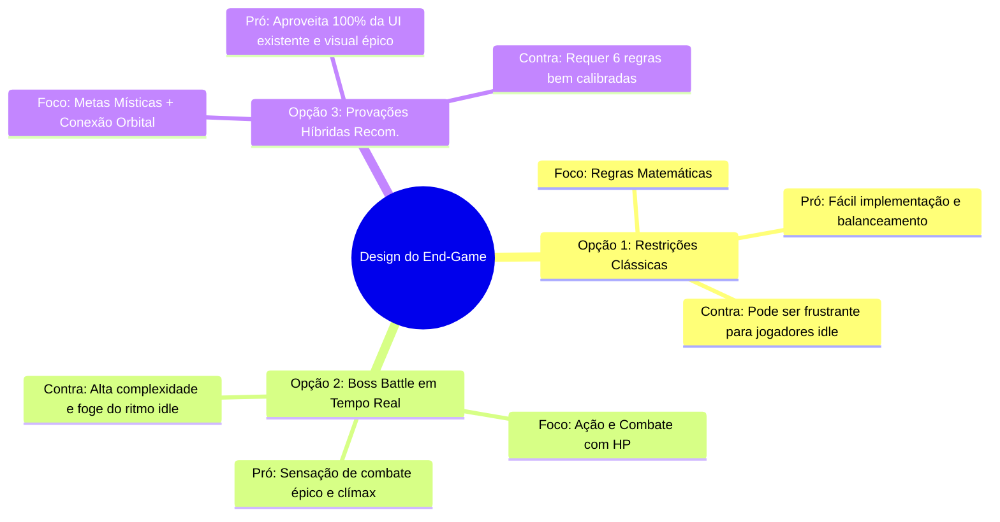
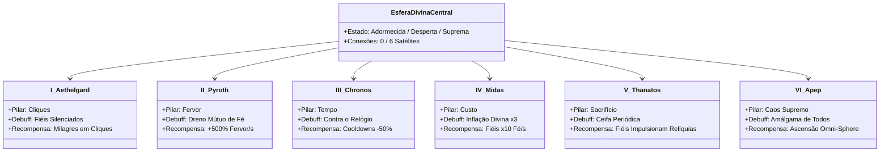
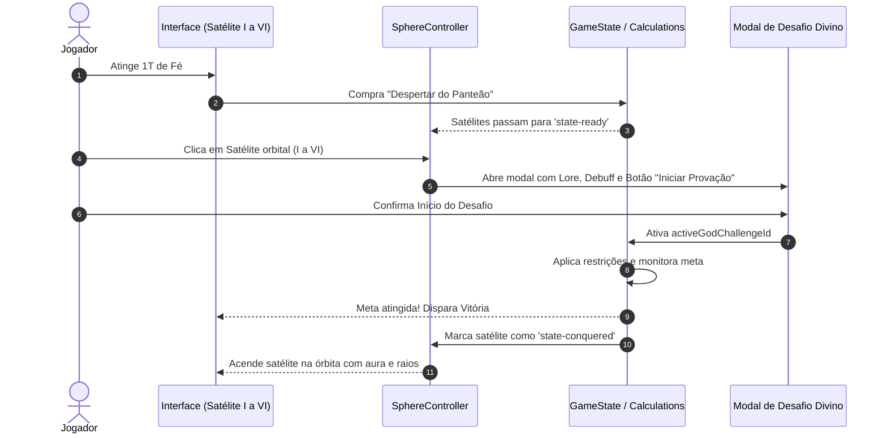

# 🌌 Propostas de End-Game: Os 6 Desafios dos Deuses & Esfera Suprema
> **Cult of the Sphere (WMDG)** — Especificação de Design, Balanceamento e Arquitetura

---

## 🧭 Visão Geral

Este documento apresenta a especificação completa para o **End-Game** do jogo, integrando as **6 Esferas Satélites Orbitais** que cercam a Esfera Divina Central com uma mecânica de **Desafios contra Deuses Cósmicos**, desbloqueada na faixa de **1 Trilhão ($10^{12}$)** de Pontos.

---

## 1. ⚖️ Esclarecimento do Marco: O que é "1T de PF"?

Na economia de recursos do jogo, a sigla **PF** pode corresponder a dois eixos:

| Recurso | Escala ($10^{12}$) | Momento da Jornada | Papel no End-Game |
|---|:---:|---|---|
| **Pontos de Fé** | **1T Fé** | Logo após a estabilização das Relíquias (Cornucópia, Tocha e Arca da Aliança). | **Marco de Desbloqueio (*Unlock*)**: Perfeito para revelar a nova aba/modal sem impor uma espera de dias. |
| **Pontos de Fervor** | **1T Fervor** | Deep Late-Game, após investir pesado no 6º rito (`fu_relics`) e na sinergia Fé $\leftrightarrow$ Fervor. | **Combustível Ritual**: O custo consumido para acender o fogo do desafio e enfrentar cada divindade. |

> [!TIP]
> **Fórmula Recomendada**: 
> - **Desbloqueio Global**: 1 Trilhão de Fé (`cost: 1_000_000_000_000`, `costCurrency: 'faith'`) na aba **Unlocks**.
> - **Custo de Entrada em cada Desafio**: Oferenda em **Fervor acumulado** (ex: 50B a 500B de Fervor por tentativa de desafio).

---

## 2. 📊 Comparativo das 3 Abordagens de Design

### Quadro Detalhado de Prós e Contras

| Critério | Opção 1: Desafios Restritivos Clássicos | Opção 2: Boss Battles com HP Cósmico | Opção 3: Provações Híbridas (Recomendada) |
|---|---|---|---|
| **Mecânica Principal** | Jogar com restrições severas (ex: sem devotos) até bater uma meta de Fé. | Causar "dano" contínuo em uma barra de HP divino contra o relógio. | Cumprir uma meta temática que libera e ilumina permanentemente o satélite correspondente. |
| **Complexidade de Código** | 🟢 **Baixa**: Adiciona modificadores nas funções de `calculations.ts`. | 🔴 **Alta**: Exige gerenciar máquina de estados de boss, ticks de dano e IA simples. | 🟡 **Média**: Modificadores nos cálculos + manipulação visual dos 6 nós já existentes. |
| **Aderência ao Gênero Idle** | 🟢 Perfeita (*Cookie Clicker*, *Antimatter Dimensions*). | 🟡 Média (exige foco manual intenso na tela). | 🟢 Excelente (oferece foco ativo opcional sem travar o idle). |
| **Impacto Visual / Efeito WOW** | 🟡 Baixo (apenas números e textos mudando). | 🟢 Alto (barra de vida descendo e efeitos). | 🟣 **Máximo** (as 6 esferas orbitais ganham raios sagrados conectados à Esfera central). |
| **Rejogabilidade / Satisfação** | 🟡 Boa, porém linear. | 🟡 Pode se tornar repetitiva se for muito longa. | 🟢 **Progresso visual palpável** (cada deus vencido acende 1/6 da coroa). |

---

## 3. 🏛️ Os 6 Deuses do Panteão (Satélites I a VI)

Os 6 nós orbitais já presentes no código (`sphere-satellite-node`, de **0 a 5**) representam os **6 Deuses Primordiais** que guardam a Esfera Cósmica:

### Detalhamento das Provações Divinas

#### ⚡ Satélite I — Aethelgard, Deus do Silêncio
* **Pilar**: Cliques Sagrados e Devoção Manual.
* **Restrição do Desafio**: O santuário entra em silêncio absoluto. Todos os Fiéis Devotos produzem **0 Fé/s**. Toda a progressão depende unicamente do toque na Esfera.
* **Meta**: Acumular **500 Bilhões de Fé** manualmente sob silêncio.
* **Recompensa Permanente**: +100% de Fé por Clique e **15% de chance de cada clique disparar um Milagre Divino automático**.

---

#### 🔥 Satélite II — Pyroth, O Forjador das Chamas
* **Pilar**: Fervor Cósmico e Combustão Divina.
* **Restrição do Desafio**: A geração acelerada de Fervor incendeia o santuário, drenando Fé continuamente na mesma proporção em que o Fervor queima.
* **Meta**: Sustentar **10 Bilhões de Fervor** sem deixar o estoque de Fé zerar.
* **Recompensa Permanente**: **+500% de produção de Fervor/seg** permanente e imunidade a qualquer penalidade futura de chamas.

---

#### ⏳ Satélite III — Chronos, O Tecelão Temporal
* **Pilar**: Velocidade, Precisão e Ritmo.
* **Restrição do Desafio**: Corrida contra o relógio divino. O jogador dispõe de apenas **180 segundos (3 minutos)** para atingir o ápice de devoção antes que a linha temporal colapse.
* **Meta**: Atingir **1 Trilhão de Fé** antes do cronômetro zerar.
* **Recompensa Permanente**: **Redução de 50% em todos os cooldowns** do jogo (consagração de Relíquias, Bênção da Incarnation e recargas de Milagres).

---

#### 👑 Satélite IV — Midas Cósmico, O Avaro Divino
* **Pilar**: Economia, Gestão e Resistência à Escassez.
* **Restrição do Desafio**: Inflação Cósmica Severa. A fórmula de escala de custo de todos os Fiéis e melhorias sobe para o triplo do normal ($1.30^N$ em vez de $1.10^N$).
* **Meta**: Conseguir recrutar **100 Fiéis Devotos** sob essa economia esmagadora.
* **Recompensa Permanente**: **Produção de Fé de todos os Fiéis multiplicada permanentemente por x10**.

---

#### 💀 Satélite V — Thanatos, O Ceifador de Almas
* **Pilar**: Sacrifício, Finitude e Transcendência.
* **Restrição do Desafio**: A cada 20 segundos, uma névoa sombria varre o santuário e **consome 25% dos Fiéis atuais**. O jogador precisa repovoar e manter a fé viva.
* **Meta**: Acumular **5 Trilhões de Fé** enquanto lida com as baixas contínuas.
* **Recompensa Permanente**: Cada Fiel no culto passa a conceder um bônus de **+1% multiplicativo direto no ganho de Relíquias**.

---

#### 🌌 Satélite VI — Apep, O Vazio Primordial (O Confronto Final)
* **Pilar**: Caos Cósmico e Convergência Suprema.
* **Requisito de Entrada**: Ter derrotado e iluminado os Satélites **I a V**.
* **Restrição do Desafio**: Todos os 5 debuffs anteriores são ativados simultaneamente de forma atenuada (Fiéis produzem -50%, dreno suave de Fé, limite de 5 minutos e escala de custo acelerada).
* **Meta**: Alcançar **10 Trilhões de Fé**.
* **Recompensa Suprema — ASCENSÃO OMNI-SPHERE**:
  - A Esfera Divina Central adquire a forma cósmica final.
  - Raios contínuos de partículas conectam todos os 6 satélites à Esfera.
  - **Multiplicador Global Permanente de x100** sobre toda a produção.
  - Conclusão da campanha com desbloqueio do modo **Novo Jogo+ / Transcendente**.

---

## 4. 🛠️ Arquitetura de Implementação no Código

### Arquivos e Responsabilidades

1. **`src/config/gods.ts`** *(Novo arquivo)*:
   - Configuração tipada dos 6 deuses: IDs, nomes, lore, restrições, metas e bônus concedidos.
2. **`src/config/unlocks.ts`**:
   - Adicionar o marco `'unlock_pantheon_challenges'` por 1T de Fé.
3. **`src/core/GameState.ts`**:
   - Controle do desafio ativo (`activeChallengeId: string | null`).
   - Armazenamento das vitórias em `godChallengesCompleted: Record<string, boolean>`.
4. **`src/systems/calculations.ts`**:
   - Leitura do desafio ativo para aplicar os debuffs de Fé, cliques e custos.
5. **`src/features/sphere/SphereController.ts`**:
   - Tratamento de clique nos nós orbitais para disparar o modal de desafio.
   - Atualização visual dos estados CSS (`state-locked` $\rightarrow$ `state-ready` $\rightarrow$ `state-conquered`).
6. **`src/styles/sphere.css`**:
   - Animação de raios energéticos e brilho pulsante dourado/cósmico nos satélites conquistados.

---

> [!NOTE]
> Este plano preserva todas as mecânicas já construídas, aproveita a estrutura HTML/CSS existente da Esfera e proporciona um objetivo final claro e recompensador para o jogador.
