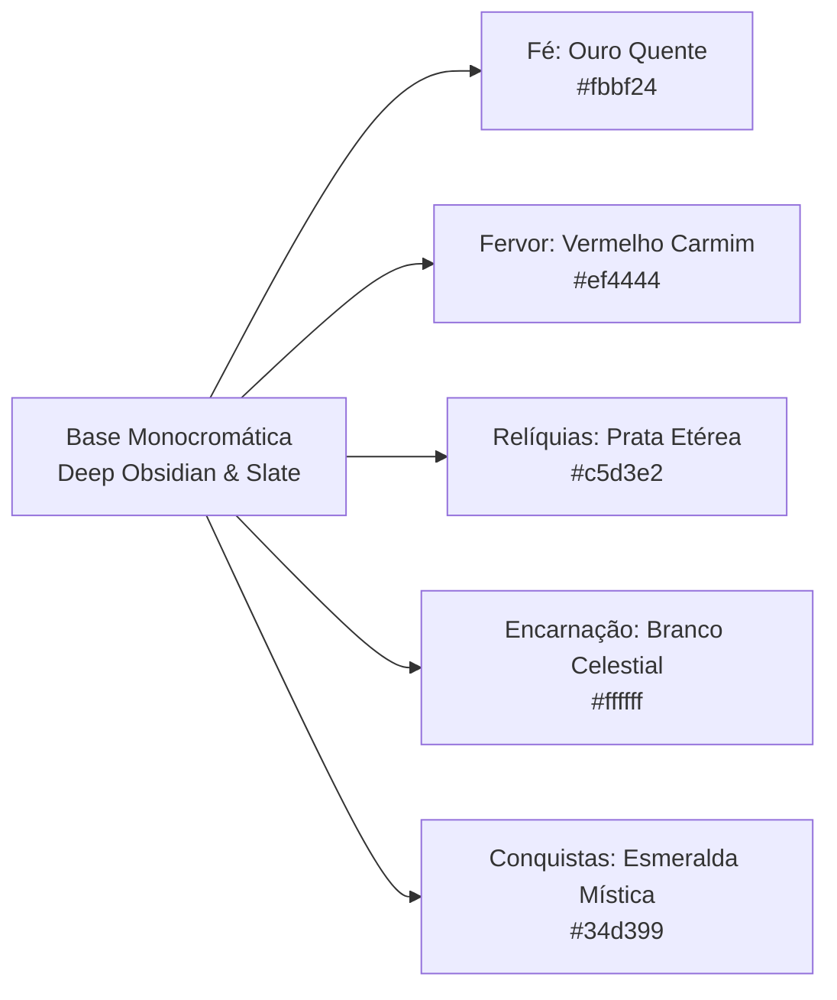

# 🎨 Análise Completa de UX/UI, Cores, Esquemas & Versão Mobile
## Cult of the Sphere (WMDG)

> **Documento de Auditoria e Diretrizes de Design de Experiência e Interface**  
> **Status:** Proposta de Melhorias & Diagnóstico Técnico  
> **Repositório:** [wmdg](file:///home/luan/Documents/wmdg)  
> **Arquivos Analisados:** [index.html](file:///home/luan/Documents/wmdg/index.html), [src/style.css](file:///home/luan/Documents/wmdg/src/style.css), [src/main.ts](file:///home/luan/Documents/wmdg/src/main.ts), [src/ui/tooltips.ts](file:///home/luan/Documents/wmdg/src/ui/tooltips.ts), [src/ui/followersArena.ts](file:///home/luan/Documents/wmdg/src/ui/followersArena.ts), [src/ui/incarnationArena.ts](file:///home/luan/Documents/wmdg/src/ui/incarnationArena.ts)

---

## 1. Visão Geral & Filosofia Visual

**Cult of the Sphere** adota uma identidade visual imersiva e mística, combinando **Dark Glassmorphism** (vidro escuro translúcido com desfoque de fundo) com uma paleta de base **Deep Obsidian / Monocromática Cósmica**, enriquecida por acentos cromáticos temáticos que guiam a progressão do jogador:



### Pilares da Identidade Atual:
1. **Atmosfera de Seita Cósmica**: Fundo quase negro (`#080a0f`) com gradiente radial sutil (`#11141d`), evocando o vazio do cosmos e a presença de uma entidade primordial.
2. **Acentos Cromáticos Hierárquicos**: Cada recurso central do jogo possui uma assinatura visual única e inequívoca, facilitando o reconhecimento em frações de segundo.
3. **Cards e Painéis em Vidro com Bordas de Luz**: Aplicação de `backdrop-filter: blur(16px)` e bordas em tons de cinza/prata (`--border-mid`, `--border-light`, `--border-white`) para dar profundidade e sofisticação à interface.

---

## 2. Anatomia dos Esquemas de Cores & Avaliação de UX

Abaixo detalha-se o sistema de tokens em [src/style.css](file:///home/luan/Documents/wmdg/src/style.css#L1-L25), a aplicação semântica e a análise de contraste e usabilidade.

### 2.1. Tokens de Cores Globais (`:root`)

| Variável | Valor Hex / RGBA | Finalidade Semântica | Avaliação de Usabilidade / UX |
|---|---|---|---|
| `--bg-dark` | `#080a0f` | Fundo principal da página e body | Excelente para imersão noturna e economia de energia em telas OLED. |
| `--bg-panel` | `rgba(13, 16, 23, 0.92)` | Superfície dos cards e painéis | Vidro escuro elegante com 92% de opacidade, permitindo leitura nítida sem perder o desfoque de fundo. |
| `--gold-accent` | `#f59e0b` / `#fbbf24` | Recurso **Fé (PF)**, botões primários | Tom âmbar/dourado caloroso e recompensador. Transmite valor divino. |
| `--gold-light` | `#f4f4f5` / `#fef08a` | Destaques de texto e números de Fé | Alto contraste e brilho estelar sobre fundo escuro. |
| `--red-accent` | `#ef4444` / `#b91c1c` | Recurso **Fervor**, botões de perigo | Vermelho rubi vibrante. Comunica zelo fanático, sacrifício e urgência. |
| `--border-dark` | `#18181b` | Divisores internos discretos | Separação de seções sem poluir a visão. |
| `--border-muted` | `#27272a` | Bordas padrão de cards inativos | Sutileza e contenção. |
| `--border-mid` | `#52525b` | Bordas de cards interativos | Fornece contorno perceptível sem gritar na tela. |
| `--border-light` | `#a1a1aa` | Bordas de hover e destaque | Resposta imediata ao foco do jogador. |
| `--border-white` | `#ffffff` | Bordas ativas / selecionadas | Máxima ênfase visual de estado ativo. |
| `--text-main` | `#f8fafc` | Texto primário, títulos e números | Contraste de **17.8:1** contra `--bg-dark` (Supera WCAG AAA). |
| `--text-muted` | `#94a3b8` | Subtítulos, labels e descrições | Contraste de **8.1:1** contra fundo escuro. Excelente legibilidade em desktop. |

---

### 2.2. Assinatura Cromática dos Recursos do Jogo

```
┌────────────────────────────────────────────────────────────────────────┐
│                                                                        │
│   [ FÉ (PF) ]               [ FERVOR ]               [ RELÍQUIAS ]     │
│   #fbbf24 (Âmbar Ouro)      #ef4444 (Carmim)         #c5d3e2 (Prata)   │
│   Glow: rgba(251,191,36)    Glow: rgba(239,68,68)    Glow: #bad2eb     │
│                                                                        │
└────────────────────────────────────────────────────────────────────────┘
```

1. **Fé (PF — Pontos de Fé)**:
   - **Cor Primária**: Ouro estelar (`#fbbf24`) e Ouro solar (`#f59e0b`).
   - **Efeito Visual**: `text-shadow: 0 0 10px rgba(251, 191, 36, 0.45)`. Quando ativado o buff da Bênção da Encarnação (2x Fé), ganha animação pulsante `boostRatePulse` alternando brilho.
   - **Impacto no Jogador**: Sensação de riqueza e expansão contínua. É o recurso mais frequente e deve ter o maior conforto visual prolongado.

2. **Fervor (Chama do Culto)**:
   - **Cor Primária**: Vermelho Carmim (`#ef4444`) com variações em coral (`#f87171`).
   - **Efeito Visual**: Acentos em vermelho com bordas e tags incandescentes.
   - **Impacto no Jogador**: Contraste direto com o ouro da Fé. O vermelho cria tensão e estimula a atenção do jogador para rituais e compras estratégicas.

3. **Relíquias Sagradas (PR)**:
   - **Cor Primária**: Prata Gélida / Platina Etérea (`#c5d3e2`, `#dbe6f0`, `#b0c2d4`).
   - **Efeito Visual**: `text-shadow: 0 0 8px rgba(186, 210, 235, 0.6)`.
   - **Impacto no Jogador**: Sensação de prestígio antigo e transcendental. Quebra o duo clássico ouro/vermelho com um toque lunar refinado.

4. **Encarnação & Rituais Celestiais**:
   - **Cores**: Branco puro (`#ffffff`), Púrpura cósmico translúcido e partículas em ouro e prata.
   - **Impacto**: O orbe central e a figura da Encarnação atuam como pontos focais de iluminação no centro escuro da tela.

---

### 2.3. Auditoria de Contraste e Acessibilidade (WCAG 2.1)

> [!NOTE]
> A paleta escura atual é muito agradável esteticamente em telas de alta qualidade (desktop e monitores calibrados), mas apresenta alguns gargalos em telas de smartphones com brilho sob luz solar ou para usuários com fadiga ocular.

#### Pontos Críticos Identificados:
1. **Cards Inacessíveis (`.cult-action-card.unaffordable`)**:
   - Atualmente usam `opacity: 0.65` somado a textos em `--text-muted` (`#94a3b8`).
   - Em telas pequenas ou sob reflexos, a informação de custo e nome do upgrade fica quase invisível, dificultando saber quanto falta para poder comprar.
2. **Textos de Menor Escala (9px e 10px)**:
   - Labels como `.panel-tag` (10px), `.resources-hud-header` (9px) e `.followers-stat-label` (9px) são excessivamente pequenos para visualização em telas móveis densas (DPI alto), violando o tamanho mínimo recomendado de **12px** para legibilidade sem zoom.
3. **Diferenciação para Daltonismo (Protanopia / Deuteranopia)**:
   - A combinação de Ouro (`#fbbf24`) e Vermelho (`#ef4444`) pode ter luminosidade percebida similar para certos graus de daltonismo. O uso de ícones distintos e prefixos textuais claros (ex: "PF" para Fé, "Fervor" explícito, "PR" para Relíquias) atenua esse problema, mas precisa ser reforçado nas barras de progresso.

---

## 3. Análise Detalhada da Experiência Mobile

Ao inspecionar a implementação dos estilos em [src/style.css](file:///home/luan/Documents/wmdg/src/style.css), o layout de 3 quadros em [index.html](file:///home/luan/Documents/wmdg/index.html) e a lógica de interação em [src/main.ts](file:///home/luan/Documents/wmdg/src/main.ts), detectamos problemas severos de experiência quando a página é acessada em dispositivos móveis (larguras entre **360px e 430px**).

### 3.1. O Diagnóstico das Media Queries Atuais

No arquivo [src/style.css](file:///home/luan/Documents/wmdg/src/style.css#L2134-L2168), existem **apenas 3 regras de media query** em mais de 3.000 linhas de CSS:

```css
@media (max-width: 1100px) {
  .side-panel {
    width: 300px;
    min-width: 280px;
  }
}

@media (max-width: 860px) {
  .gameplay-3frame-container {
    gap: 8px;
  }
  .side-panel {
    position: absolute;
    top: 0;
    bottom: 0;
    width: 310px;
    z-index: 30;
  }
  .side-panel-left {
    left: 0;
  }
  .side-panel-right {
    right: 0;
  }
}

@media (max-width: 640px) {
  .top-hud-bar {
    padding: 10px 16px;
  }
  .resources-hud-card {
    top: 8px;
    padding: 6px 14px;
  }
}
```

---

### 3.2. Os 7 Principais Problemas na Versão Mobile

#### 💥 1. A Colisão dos Painéis Laterais (Bloqueio Total da Tela)
- **O Problema**: No HTML padrão, tanto `#panel-left` quanto `#panel-right` vêm inicializados com as classes `open` (nenhum tem `collapsed`).
- **O Que Acontece no Celular (`width: 375px`)**:
  - O painel esquerdo ganha `position: absolute; left: 0; width: 310px; z-index: 30`.
  - O painel direito ganha `position: absolute; right: 0; width: 310px; z-index: 30`.
  - Como `310px + 310px = 620px > 375px`, **os dois painéis colidem e sobrepõem-se no centro da tela**.
  - O quadro central (`.center-frame`), onde reside o orbe de clique e os satélites orbitais, fica **100% ocultado**.
  - O jogador abre o jogo no smartphone e não consegue clicar no orbe principal sem antes descobrir acidentalmente que precisa fechar manualmente os dois painéis através de botões minúsculos de 32px.

```
+------------------------------------+
|  [HUD RECURSOS SOBREPOSTO AO TOPO] |
+------------------------------------+
| [PAINEL ESQUERDO]  |               |
|      (310px)       | [PAINEL DIR.] |
|   <- SOBREPOSIÇÃO -> |   (310px)     |
|   A Esfera Divina central sumiu!   |
+------------------------------------+
```

---

#### 📐 2. Overflow da Esfera Divina e dos Satélites Orbitais
- Em [src/style.css:1872](file:///home/luan/Documents/wmdg/src/style.css#L1872), `.sphere-satellites-orbit` possui:
  - `width: 320px; height: 320px;`
  - Os nós satélites possuem `transform: rotate(var(--node-angle)) translateY(-155px);`.
  - O raio total da órbita com os nós (46px) atinge cerca de **356px de diâmetro ativo**.
  - Somando-se ao padding do container e aos anéis de órbita (`.ring-2` de 290px), a esfera ocupa praticamente 100% ou transborda a largura de celulares comuns (como iPhone SE 375px ou telas de 360px), gerando cortes ou acionando barras de rolagem invisíveis.
- Além disso, tocar em satélites em rotação constante de 70 segundos em uma tela sensível ao toque de 5 polegadas é uma tarefa frustrante para a ponta dos dedos ("*Fat Finger Syndrome*").

---

#### 🔍 3. Paralisia dos Tooltips em Dispositivos Touch
- O [TooltipManager](file:///home/luan/Documents/wmdg/src/ui/tooltips.ts) foi construído inteiramente com base em eventos de mouse de desktop:
  ```typescript
  // src/ui/tooltips.ts
  public position(e: MouseEvent): void {
    const tooltipWidth = 340;
    // ... calcula baseando-se em e.clientX e e.clientY
  }
  ```
- **Consequências no Mobile**:
  - Telas touch não possuem cursor flutuante (`hover`).
  - Quando o jogador toca em um upgrade para comprar, o evento `click` pode disparar uma emulação de hover que abre o tooltip de 340px diretamente debaixo do dedo ou cobrindo o próprio botão que ele queria apertar.
  - O tooltip fica "preso" na tela, pois não há botão de fechar (`X`) nem detecção de toque fora do elemento para escondê-lo.
  - O jogador perde o acesso a detalhes vitais como fórmulas matemáticas (DodecaDragons), lore místico e porcentagem de contribuição daquele upgrade.

---

#### 👆 4. Alvos de Toque Inadequados (Violação da Lei de Fitts e Padrões Apple/Google)
- O padrão de acessibilidade móvel recomenda alvos mínimos de **44 × 44 pt (Apple HIG)** ou **48 × 48 dp (Google Material Design)**.
- Vários elementos cruciais no jogo violam esse critério:
  - Botões de recolher/expandir painel (`.panel-toggle-btn`): **32 × 32 px**.
  - Faixas verticais de expandir (`.panel-expand-strip`): botões laterais estreitos com texto verticalizado (`writing-mode: vertical-rl`), fáceis de errar ou de disparar o gesto de "voltar" nativo das bordas do Android e iOS.
  - Abas de navegação interna (`.panel-tab-btn`): altura reduzida com fontes de 11px, gerando toques acidentais na aba errada.
  - Nós satélites: 46px, porém em movimento contínuo ao redor do orbe.

---

#### 📱 5. Congestionamento do HUD Superior (Header)
- A barra do topo (`.top-hud-bar`) abriga:
  1. O card central de recursos (`.resources-hud-card` posicionado com `position: absolute; left: 50%; transform: translateX(-50%)`).
  2. Os botões de áudio e configurações (`.top-right-group`).
- Em larguras menores que 420px:
  - O card central de recursos possui largura considerável (exibe Fé, Fervor, Relíquias, taxas por segundo e labels).
  - O card passa por cima do botão de música (`#music-quick-btn`) e configurações (`#settings-btn`), impedindo o clique ou criando sobreposição feia de textos sobre ícones.

---

#### 🔋 6. Desempenho dos Canvases Duplos no Mobile
- Existem dois canvases com animações contínuas a 60 FPS via `requestAnimationFrame`:
  1. [FollowersArena](file:///home/luan/Documents/wmdg/src/ui/followersArena.ts) (cultistas caminhando, rezando e soltando partículas).
  2. [IncarnationArena](file:///home/luan/Documents/wmdg/src/ui/incarnationArena.ts) (avatar sagrado com pulso energético e ondas de choque).
- Ambos calculam `dpr = Math.min(window.devicePixelRatio || 1, 2)`. Em telas mobile com tela Retina/AMOLED de 3x ou 4x, o canvas renderiza em dobro ou triplo de pixels lógicos, o que eleva a temperatura do aparelho e drena a bateria rapidamente se os painéis estiverem em segundo plano sem pausa inteligente.

---

#### 🔲 7. Ausência de Tratamento para Notches e Safe Areas
- O container do app não faz uso de `env(safe-area-inset-top)` nem `env(safe-area-inset-bottom)`.
- No iPhone com Dynamic Island ou Notch, a barra de recursos do topo fica parcialmente cortada.
- No Android e iOS modernos, a barra gestual inferior (Home Indicator) fica sobreposta aos botões inferiores de upgrades e rodapé.

---

## 4. Comparativo de Arquitetura: Desktop vs. Mobile Proposto

Para resolver a sobreposição caótica de 3 colunas em telas verticais de smartphones, a melhor prática internacional de jogos idle (como *Kittens Game*, *Universal Paperclips* e *Realm Grinder Mobile*) é a transição de um **layout de 3 colunas simultâneas** para um modelo de **Visualização em Aba Única com Barra de Navegação Inferior (Bottom Navigation Bar)**:

| Característica | Desktop Atual (>= 1024px) | Mobile Atual (< 860px - Falho) | Mobile Proposto (Redesign Otimizado) |
|---|---|---|---|
| **Disposição Geral** | 3 colunas lado a lado (Flex) | 2 painéis absolutos colidindo no centro | **1 tela ativa por vez com transição fluida** |
| **Navegação Principal** | Clicar e colapsar laterais | Botões laterais apertados de 32px | **Bottom Bar fixa com 4 seções principais** |
| **Acesso ao Orbe Divino** | Sempre no centro | Fica escondido atrás dos painéis | **Aba dedicada "Esfera Divina" ou orbe compacto fixo** |
| **Inspeção de Upgrades** | Tooltip flutuante ao passar o mouse | Tooltip trava no dedo e cobre a tela | **Bottom Sheet (gaveta inferior deslizante) ao segurar/tocar** |
| **Área do Topo (HUD)** | Card flutuante central + Ações | Conflito e sobreposição com botões | **Barra horizontal compacta de recursos (1 linha ou carrossel)** |
| **Alvos de Toque** | 32px a 40px (ótimo para cursor) | Difíceis de acertar com o polegar | **Mínimo de 48px para qualquer área interativa** |

---

## 5. Lista de Tarefas Priorizada (To-Do List)

Abaixo está o plano de ação detalhado para tornar o **Cult of the Sphere** extremamente amigável, acessível e prazeroso de jogar tanto no computador quanto no celular.

### 🔴 Prioridade P0: Correções Críticas (Mobile & Bloqueios)

- [ ] **P0.1: Reestruturar o Comportamento Inicial dos Painéis em Telas Menores**
  - *Ação*: Em telas `< 860px`, garantir via JS e CSS que os painéis iniciem **recolhidos** (`.collapsed`) ou que apenas a Esfera Divina esteja visível na primeira carga.
  - *Resultado*: O jogador verá imediatamente o orbe sagrado ao carregar o jogo no smartphone, podendo começar a clicar de pronto.

- [ ] **P0.2: Implementar Bottom Navigation Bar no Mobile**
  - *Ação*: Criar uma barra inferior fixa no mobile com 4 abas ergonômicas para os polegares:
    1. 👁️ **Esfera** (Orbe principal + satélites)
    2. 🏛️ **Devotos** (Fiéis, arena de cultistas, Encarnação sagrada)
    3. 🔮 **Desbloqueios** (Upgrades de Fervor, Relíquias, Alquimia)
    4. 🏆 **Culto** (Estatísticas, Conquistas, Configurações)
  - *Resultado*: Elimina a necessidade de abrir e fechar painéis que colidem; a troca de tela ocorre em 1 toque no rodapé.

- [ ] **P0.3: Substituição do Tooltip de Mouse por "Modal de Inspeção / Bottom Sheet"**
  - *Ação*: No mobile, substituir a renderização flutuante atrelada a coordenadas de mouse por um *Bottom Sheet* deslizante (ou modal com botão de fechar `X`), aberto ao clicar no ícone de interrogação `(?)` ou ao pressionar e segurar um card de upgrade.
  - *Resultado*: Fim dos tooltips travados na tela do celular; leitura limpa das fórmulas matemáticas de DodecaDragons e descrições lore.

- [ ] **P0.4: Responsividade Fluida do Orbe e Satélites Orbitais**
  - *Ação*: Utilizar CSS `clamp()` e variáveis responsivas para dimensionar a Esfera Divina e sua órbita:
    ```css
    :root {
      --sphere-size: clamp(140px, 35vw, 190px);
      --orbit-radius: clamp(110px, 30vw, 155px);
    }
    ```
  - *Resultado*: A órbita nunca ultrapassará as bordas de telas estreitas (360px a 390px), mantendo a beleza e a proporção harmônica da geometria sagrada.

- [ ] **P0.5: Refatoração do HUD de Recursos para Mobile**
  - *Ação*: Em telas `< 640px`, desacoplar o HUD central de `position: absolute` e transformá-lo em uma barra de status integrada no topo, alinhando Fé, Fervor e Relíquias de forma flexível ou em grid horizontal, posicionando os botões de áudio e configurações sem sobreposição.

---

### 🟡 Prioridade P1: Ergonomia, Acessibilidade & Usabilidade

- [ ] **P1.1: Adequação Universal da Lei de Fitts (Alvos de Toque >= 48px)**
  - *Ação*: Aumentar botões de navegação, abas (`.panel-tab-btn`) e ícones de alternância para no mínimo 48px de altura/largura ou adicionar áreas de toque invisíveis (`::before` com `min-width: 48px; min-height: 48px`).

- [ ] **P1.2: Suporte a Safe Areas do iOS e Android**
  - *Ação*: Adicionar ao container raiz:
    ```css
    body {
      padding-top: env(safe-area-inset-top);
      padding-bottom: env(safe-area-inset-bottom);
      padding-left: env(safe-area-inset-left);
      padding-right: env(safe-area-inset-right);
    }
    ```
  - *Resultado*: Notches de iPhones e barras de navegação do sistema não cortam elementos vitais.

- [ ] **P1.3: Feedback Tátil Móvel (Vibração Háptica)**
  - *Ação*: Integrar `navigator.vibrate` (com verificação de compatibilidade) com pulsos ultracurtos:
    - Clique na Esfera Divina: `navigator.vibrate(8)` (pulso suave e satisfatório).
    - Compra de Upgrade / Desbloqueio: `navigator.vibrate([15, 30, 25])`.
    - Ativação de Bênção ou Milagre: `navigator.vibrate(40)`.
    - Adicionar toggle nas Configurações para desativar vibração se desejado.

- [ ] **P1.4: Melhoria de Contraste para Upgrades Bloqueados / Inacessíveis**
  - *Ação*: Em vez de aplicar `opacity: 0.65` em todo o card, manter o texto principal em 100% de opacidade com cor cinza legível (`#cbd5e1`), aplicando estilo escurecido apenas no fundo e adicionando uma barra sutil de progresso ("Faltam 450 Fé") para compras iminentes.

- [ ] **P1.5: Pausa Inteligente dos Canvases em Segundo Plano**
  - *Ação*: Detectar se a aba de devotos/encarnação está oculta ou colapsada. Se estiver invisível, cancelar temporariamente o loop do `requestAnimationFrame` daquele canvas.
  - *Resultado*: Redução drástica no consumo de bateria e aquecimento de celulares.

---

### 🟢 Prioridade P2: Refinamento Visual, Micro-Interações & "Juice"

- [ ] **P2.1: Indicadores Notificadores de Compra Acessível (Badges)**
  - *Ação*: Adicionar uma sutil bolinha dourada pulsante (`notification-badge`) nas abas da barra de navegação sempre que houver um novo upgrade desbloqueado ou que o jogador acumular recursos suficientes para comprar um marco importante.

- [ ] **P2.2: Otimização dos Números Flutuantes no Mobile**
  - *Ação*: No desktop, os números flutuantes de clique sobem e desaparecem em posições fixas. No mobile, agrupar cliques rápidos em cascata para evitar sobrecarga de nós no DOM (`floating-faith-num`), mantendo 60 FPS contínuos durante sessões de cliques frenéticos.

- [ ] **P2.3: Tutorial / Dica Inicial para Primeiro Acesso Mobile**
  - *Ação*: Adicionar uma dica pulsante discreta nos primeiros 5 segundos: *"Toque na Esfera Divina para manifestar a Fé"*, sumindo no momento do primeiro toque.

- [ ] **P2.4: Notação Numérica Alternativa nas Configurações**
  - *Ação*: Permitir que o jogador escolha no menu de configurações entre a notação simplificada padrão (`1.5k`, `2.50M`), notação científica (`1.50e6`) ou notação clássica de jogos idle (`1.50 M`, `1.50 B`, `1.50 T`).

---

## 6. Mockup Conceitual da Nova Interface Mobile

```
┌────────────────────────────────────────────────────────┐
│  [Ícone Seita]   FÉ: 12.5k (120/s)  •  FERVOR: 85      │ [⚙️] [🎵]
├────────────────────────────────────────────────────────┤
│                                                        │
│                                                        │
│                    . - ~ ~ ~ - .                       │
│                . '       I       ' .                   │
│              /    VI            II   \                 │
│             |         (  👁️  )        |                │
│             |          ORBE          |                 │
│              \    V            III   /                 │
│                . '       IV      ' .                   │
│                    ' - _ _ _ - '                       │
│                                                        │
│           [ CANALIZAR PODER DA ENTIDADE ]              │
│                 +15 Fé por Toque                       │
│                                                        │
│   --------------------------------------------------   │
│   Bênção Ativa: 2x FÉ (14.2s restantes) ▓▓▓▓▓▓░░░░     │
│                                                        │
├────────────────────────────────────────────────────────┤
│   [ 👁️ Esfera ]   [ 🏛️ Devotos ]   [ 🔮 Ritos ]   [ 🏆 Mais ] │
│      Ativo           (+1 Novo)                       │
└────────────────────────────────────────────────────────┘
  ▲ Bottom Navigation Bar (Fácil alcance dos polegares)
```

---

## 7. Conclusão

O jogo **Cult of the Sphere** possui uma **excelente base artística, atmosfera envolvente e identidade temática autêntica**. O uso da estética *Dark Glassmorphism* com diferenciação em ouro, vermelho e prata confere um visual único e memorável para navegadores de computador.

Entretanto, para atingir o público de jogos web móveis e proporcionar uma experiência verdadeiramente agradável, a **reestruturação do layout de 3 quadros para uma arquitetura adaptativa com Bottom Navigation Bar e Bottom Sheet de inspeção** é a medida de maior impacto e necessidade imediata.

Com as correções da lista **P0** implementadas, o jogo transformará uma experiência atualmente congestionada no mobile em um clicker de altíssima fluidez, pronto para encantar devotos em qualquer tamanho de tela.
